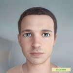

# Sierz  Anmart

                                       

### My Goal - *__To to become a full stack developer__*.   
****  
#### Contact
__Address:__ *Torun, Poland*  
  
__Phone:__ *+48 6854785142*
   
__Email:__ *SW4Strony@gmail.com*  

__Discord name__: *Sierz#8980*  
  
  **GitHub: [Anmart0309][1].**

[1]: https://github.com/Anmart0319 "Гугл" 

#### Education and courses:
* Belarusian State Technological University 
  Design engineer, Minsk, Belarus  

* Basic Front-End Developer Course   
[udemy.com](https://www.udemy.com/share/101Wy23@SoAVUfhOxMvH2BEFO7epAmttYr29LsOxMxp-sDshRD1nLVBsvMi3zbeR2HTIIwoP5g==/)

#### Experience:
  _16 years of experience in engineering_

#### Languages:                 
__Belarussian__ - _Native_   
__Russian__ - _Native_  
__Polish__ - _Upper Intermediate_        
__English__ - _Pre Intermediate_  

__Hobbies__: _Travel, writing code, swimming._  